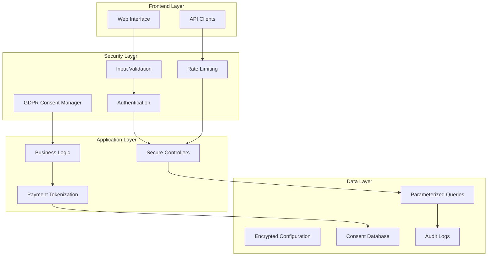

# Design Document

## Overview

This design document outlines the comprehensive approach to remediate the 5 critical and high-severity security vulnerabilities identified in the QloApps security audit. The design focuses on implementing secure coding practices, proper data handling, API security controls, credential management, and GDPR compliance while maintaining system functionality and following established Git flow processes.

The solution addresses immediate security threats while establishing a foundation for ongoing security improvements and compliance maintenance.

## Architecture

### Security Architecture Principles

1. **Defense in Depth**: Multiple layers of security controls
2. **Least Privilege**: Minimal access rights for all components
3. **Secure by Default**: Security controls enabled by default
4. **Input Validation**: Comprehensive validation at all entry points
5. **Encryption at Rest and Transit**: Protect sensitive data throughout its lifecycle
6. **Audit and Monitoring**: Comprehensive logging and monitoring capabilities

### High-Level Architecture



## Components and Interfaces

### 1. SQL Injection Prevention System

#### Secure Database Access Layer
- **Component**: `SecureDatabaseManager`
- **Location**: `/classes/security/SecureDatabaseManager.php`
- **Purpose**: Centralized secure database access with parameterized queries

**Interface Design:**
```php
class SecureDatabaseManager extends Db
{
    public function secureQuery($sql, array $params = [], $useCache = false);
    public function secureGetRow($sql, array $params = []);
    public function secureExecute($sql, array $params = []);
    public function validateInput($input, $type, $options = []);
}
```

#### Authentication Security Enhancement
- **Component**: `SecureAuthenticationManager`
- **Location**: `/classes/security/SecureAuthenticationManager.php`
- **Purpose**: Secure authentication with SQL injection prevention

**Interface Design:**
```php
class SecureAuthenticationManager
{
    public function authenticateCustomer($email, $password);
    public function authenticateEmployee($email, $password);
    public function validateCredentials($email, $password);
    public function logAuthenticationAttempt($email, $success, $ip);
}
```

### 2. Secure Payment Processing System

#### Payment Tokenization Service
- **Component**: `PaymentTokenizationService`
- **Location**: `/classes/payment/PaymentTokenizationService.php`
- **Purpose**: Replace deprecated PaymentCC class with secure tokenization

**Interface Design:**
```php
class PaymentTokenizationService
{
    public function tokenizePaymentData($paymentData);
    public function retrieveTokenizedData($token);
    public function validateToken($token);
    public function revokeToken($token);
}
```

#### Secure Payment Handler
- **Component**: `SecurePaymentHandler`
- **Location**: `/classes/payment/SecurePaymentHandler.php`
- **Purpose**: PCI DSS compliant payment processing

**Interface Design:**
```php
class SecurePaymentHandler
{
    public function processPayment($bookingData, $paymentToken);
    public function validatePaymentData($paymentData);
    public function logPaymentTransaction($transactionId, $status);
    public function handlePaymentError($error, $context);
}
```

### 3. API Security and Rate Limiting System

#### API Rate Limiter
- **Component**: `APIRateLimiter`
- **Location**: `/classes/api/APIRateLimiter.php`
- **Purpose**: Implement configurable rate limiting for API endpoints

**Interface Design:**
```php
class APIRateLimiter
{
    public function checkRateLimit($apiKey, $ip, $endpoint);
    public function incrementRequestCount($apiKey, $ip, $endpoint);
    public function getRateLimitStatus($apiKey, $ip, $endpoint);
    public function configureRateLimit($endpoint, $limit, $window);
}
```

#### API Security Manager
- **Component**: `APISecurityManager`
- **Location**: `/classes/api/APISecurityManager.php`
- **Purpose**: Comprehensive API security controls

**Interface Design:**
```php
class APISecurityManager
{
    public function validateAPIKey($apiKey);
    public function authenticateRequest($request);
    public function validateInputData($data, $schema);
    public function logAPIAccess($apiKey, $endpoint, $ip, $status);
}
```

### 4. Secure Configuration Management System

#### Configuration Encryption Service
- **Component**: `ConfigurationEncryptionService`
- **Location**: `/classes/config/ConfigurationEncryptionService.php`
- **Purpose**: Encrypt and manage sensitive configuration data

**Interface Design:**
```php
class ConfigurationEncryptionService
{
    public function encryptConfiguration($key, $value);
    public function decryptConfiguration($key);
    public function rotateEncryptionKey();
    public function validateConfigurationIntegrity();
}
```

#### Environment Configuration Manager
- **Component**: `EnvironmentConfigManager`
- **Location**: `/classes/config/EnvironmentConfigManager.php`
- **Purpose**: Manage environment-based configuration

**Interface Design:**
```php
class EnvironmentConfigManager
{
    public function loadFromEnvironment($key, $default = null);
    public function setEnvironmentVariable($key, $value);
    public function validateEnvironmentConfiguration();
    public function migrateHardcodedCredentials();
}
```

### 5. GDPR Consent Management System

#### GDPR Consent Manager
- **Component**: `GDPRConsentManager`
- **Location**: `/classes/gdpr/GDPRConsentManager.php`
- **Purpose**: Comprehensive GDPR consent tracking and management

**Interface Design:**
```php
class GDPRConsentManager
{
    public function recordConsent($customerId, $purpose, $consentData);
    public function withdrawConsent($customerId, $purpose);
    public function getConsentHistory($customerId);
    public function validateConsentForProcessing($customerId, $purpose);
    public function exportCustomerData($customerId);
    public function deleteCustomerData($customerId, $purposes = []);
}
```

#### Data Subject Rights Handler
- **Component**: `DataSubjectRightsHandler`
- **Location**: `/classes/gdpr/DataSubjectRightsHandler.php`
- **Purpose**: Handle GDPR data subject rights requests

**Interface Design:**
```php
class DataSubjectRightsHandler
{
    public function handleAccessRequest($customerId);
    public function handleRectificationRequest($customerId, $corrections);
    public function handleErasureRequest($customerId);
    public function handlePortabilityRequest($customerId);
    public function handleObjectionRequest($customerId, $purposes);
}
```

## Data Models

### Security Audit Tables

```sql
-- Security audit log table
CREATE TABLE ps_security_audit_log (
    id_audit INT AUTO_INCREMENT PRIMARY KEY,
    event_type VARCHAR(50) NOT NULL,
    severity ENUM('low', 'medium', 'high', 'critical') NOT NULL,
    description TEXT,
    user_id INT,
    ip_address VARCHAR(45),
    user_agent TEXT,
    created_at TIMESTAMP DEFAULT CURRENT_TIMESTAMP,
    INDEX idx_event_type (event_type),
    INDEX idx_severity (severity),
    INDEX idx_created_at (created_at)
);

-- API rate limiting table
CREATE TABLE ps_api_rate_limits (
    id_rate_limit INT AUTO_INCREMENT PRIMARY KEY,
    api_key VARCHAR(255) NOT NULL,
    ip_address VARCHAR(45) NOT NULL,
    endpoint VARCHAR(255) NOT NULL,
    request_count INT DEFAULT 0,
    window_start TIMESTAMP DEFAULT CURRENT_TIMESTAMP,
    last_request TIMESTAMP DEFAULT CURRENT_TIMESTAMP,
    INDEX idx_api_key (api_key),
    INDEX idx_ip_endpoint (ip_address, endpoint),
    INDEX idx_window_start (window_start)
);

-- Payment tokenization table
CREATE TABLE ps_payment_tokens (
    id_token INT AUTO_INCREMENT PRIMARY KEY,
    token_hash VARCHAR(255) UNIQUE NOT NULL,
    customer_id INT NOT NULL,
    payment_method_type VARCHAR(50),
    last_four_digits VARCHAR(4),
    expiry_date DATE,
    created_at TIMESTAMP DEFAULT CURRENT_TIMESTAMP,
    expires_at TIMESTAMP,
    is_active BOOLEAN DEFAULT TRUE,
    INDEX idx_customer_id (customer_id),
    INDEX idx_token_hash (token_hash),
    FOREIGN KEY (customer_id) REFERENCES ps_customer(id_customer)
);

-- GDPR consent tracking table
CREATE TABLE ps_gdpr_consent (
    id_consent INT AUTO_INCREMENT PRIMARY KEY,
    customer_id INT NOT NULL,
    purpose VARCHAR(100) NOT NULL,
    consent_given BOOLEAN NOT NULL,
    consent_date TIMESTAMP DEFAULT CURRENT_TIMESTAMP,
    withdrawal_date TIMESTAMP NULL,
    legal_basis VARCHAR(50),
    consent_method VARCHAR(50),
    ip_address VARCHAR(45),
    user_agent TEXT,
    INDEX idx_customer_purpose (customer_id, purpose),
    INDEX idx_consent_date (consent_date),
    FOREIGN KEY (customer_id) REFERENCES ps_customer(id_customer)
);

-- Configuration encryption table
CREATE TABLE ps_encrypted_config (
    id_config INT AUTO_INCREMENT PRIMARY KEY,
    config_key VARCHAR(255) UNIQUE NOT NULL,
    encrypted_value TEXT NOT NULL,
    encryption_method VARCHAR(50) DEFAULT 'AES-256-GCM',
    created_at TIMESTAMP DEFAULT CURRENT_TIMESTAMP,
    updated_at TIMESTAMP DEFAULT CURRENT_TIMESTAMP ON UPDATE CURRENT_TIMESTAMP,
    INDEX idx_config_key (config_key)
);
```

### GDPR Data Processing Records

```sql
-- Data processing activities table
CREATE TABLE ps_gdpr_processing_activities (
    id_activity INT AUTO_INCREMENT PRIMARY KEY,
    activity_name VARCHAR(255) NOT NULL,
    purpose VARCHAR(255) NOT NULL,
    legal_basis VARCHAR(100) NOT NULL,
    data_categories TEXT,
    retention_period VARCHAR(100),
    is_active BOOLEAN DEFAULT TRUE,
    created_at TIMESTAMP DEFAULT CURRENT_TIMESTAMP
);

-- Data subject requests table
CREATE TABLE ps_gdpr_data_requests (
    id_request INT AUTO_INCREMENT PRIMARY KEY,
    customer_id INT NOT NULL,
    request_type ENUM('access', 'rectification', 'erasure', 'portability', 'objection') NOT NULL,
    status ENUM('pending', 'processing', 'completed', 'rejected') DEFAULT 'pending',
    request_data TEXT,
    response_data TEXT,
    requested_at TIMESTAMP DEFAULT CURRENT_TIMESTAMP,
    completed_at TIMESTAMP NULL,
    INDEX idx_customer_id (customer_id),
    INDEX idx_request_type (request_type),
    INDEX idx_status (status),
    FOREIGN KEY (customer_id) REFERENCES ps_customer(id_customer)
);
```

## Error Handling

### Security Error Handling Strategy

1. **Fail Securely**: Default to deny access when errors occur
2. **Log Security Events**: Comprehensive logging without exposing sensitive data
3. **User-Friendly Messages**: Generic error messages to users, detailed logs for administrators
4. **Rate Limiting on Errors**: Implement rate limiting for failed authentication attempts

### Error Response Framework

```php
class SecurityErrorHandler
{
    public function handleAuthenticationError($error, $context);
    public function handleAuthorizationError($error, $context);
    public function handleInputValidationError($error, $context);
    public function handleRateLimitError($error, $context);
    public function logSecurityEvent($event, $severity, $context);
}
```

### Error Categories and Responses

- **Authentication Errors**: Generic "Invalid credentials" message
- **Authorization Errors**: "Access denied" with audit logging
- **Input Validation Errors**: Specific field validation messages
- **Rate Limiting Errors**: HTTP 429 with retry-after header
- **System Errors**: Generic error message with incident ID

## Testing Strategy

### Security Testing Framework

#### Unit Testing
- **SQL Injection Tests**: Verify parameterized queries prevent injection
- **Input Validation Tests**: Test all validation functions with malicious inputs
- **Encryption Tests**: Verify encryption/decryption functionality
- **Rate Limiting Tests**: Test rate limiting logic and edge cases

#### Integration Testing
- **Authentication Flow Tests**: End-to-end authentication security testing
- **Payment Processing Tests**: Secure payment flow validation
- **API Security Tests**: Complete API security control testing
- **GDPR Compliance Tests**: Consent management and data rights testing

#### Security Testing Tools
- **Automated Security Scanning**: Custom security scanners for QloApps
- **Penetration Testing**: Manual security testing of implemented fixes
- **Code Analysis**: Static code analysis for security vulnerabilities
- **Compliance Testing**: GDPR and PCI DSS compliance validation

### Test Data Management
- **Synthetic Test Data**: Use non-production data for all testing
- **Data Masking**: Mask sensitive data in test environments
- **Test Environment Isolation**: Separate test environments from production
- **Automated Test Execution**: Continuous security testing in CI/CD pipeline

## Git Flow Integration

### Branch Strategy for Security Fixes

#### Critical Security Hotfixes
- **Branch Pattern**: `hotfix/security-[vulnerability-name]`
- **Source**: `main` branch
- **Target**: `main` and `develop` branches
- **Review Requirements**: Mandatory security-focused code review

#### Security Feature Development
- **Branch Pattern**: `feature/security-[feature-name]`
- **Source**: `develop` branch
- **Target**: `develop` branch
- **Integration**: Regular integration with security testing

### Security Development Workflow

1. **Security Issue Identification**: Create security issue ticket
2. **Branch Creation**: Create appropriate security branch
3. **Implementation**: Develop security fix with comprehensive testing
4. **Security Review**: Mandatory security-focused code review
5. **Testing**: Automated and manual security testing
6. **Deployment**: Controlled deployment with monitoring
7. **Verification**: Post-deployment security validation

### Deployment Security

#### Pre-Deployment Checks
- Security test suite execution
- Code review completion
- Vulnerability scanning
- Configuration validation

#### Deployment Process
- Blue-green deployment for zero downtime
- Automated rollback capabilities
- Real-time monitoring during deployment
- Post-deployment security validation

#### Post-Deployment Monitoring
- Security event monitoring
- Performance impact assessment
- Error rate monitoring
- User feedback collection

## Performance Considerations

### Security Performance Optimization

#### Database Security Performance
- **Query Optimization**: Optimize parameterized queries for performance
- **Index Strategy**: Proper indexing for security-related queries
- **Connection Pooling**: Efficient database connection management
- **Query Caching**: Cache frequently executed security queries

#### API Security Performance
- **Rate Limiting Efficiency**: Efficient rate limiting algorithms
- **Authentication Caching**: Cache authentication results appropriately
- **Input Validation Optimization**: Efficient input validation processes
- **Security Header Optimization**: Minimize security header overhead

#### Encryption Performance
- **Algorithm Selection**: Use efficient encryption algorithms
- **Key Management**: Efficient key storage and retrieval
- **Caching Strategy**: Cache decrypted configuration appropriately
- **Hardware Acceleration**: Utilize hardware encryption when available

### Monitoring and Metrics

#### Security Metrics
- Authentication success/failure rates
- API rate limiting effectiveness
- Security event frequency
- GDPR compliance metrics

#### Performance Metrics
- Response time impact of security controls
- Database query performance
- API throughput with security controls
- System resource utilization

## Compliance and Regulatory Considerations

### GDPR Compliance Design

#### Data Protection by Design
- **Privacy by Default**: Default to most privacy-friendly settings
- **Data Minimization**: Collect only necessary personal data
- **Purpose Limitation**: Use data only for specified purposes
- **Storage Limitation**: Implement data retention policies

#### Technical and Organizational Measures
- **Access Controls**: Implement role-based access controls
- **Encryption**: Encrypt personal data at rest and in transit
- **Audit Trails**: Maintain comprehensive audit logs
- **Data Breach Response**: Implement breach detection and response procedures

### PCI DSS Compliance Design

#### Payment Card Data Protection
- **No Storage**: Eliminate storage of sensitive cardholder data
- **Tokenization**: Implement secure payment tokenization
- **Encryption**: Encrypt payment data in transit
- **Access Controls**: Restrict access to payment processing systems

#### Security Controls
- **Network Security**: Implement network segmentation and firewalls
- **Vulnerability Management**: Regular security assessments and updates
- **Access Management**: Strong authentication and access controls
- **Monitoring**: Continuous monitoring of payment processing systems

This comprehensive design addresses all critical security vulnerabilities while establishing a robust security foundation for ongoing protection and compliance.